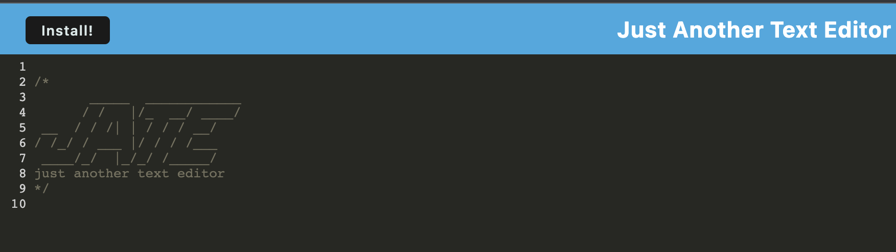

<!-- PROJECT LOGO -->
 

  

  <h1 align="center">Gucci's Text Editor APP</h1>

<!-- ABOUT THE PROJECT -->
## About The Project
I know what you're thinking "Really another text editor this is getting really old." Yes it has been done in the past but NEVER like this (well at least I've never done it like this). With this text editor you can write down notes from anywhere in the world(with wifi) and then once downloaded write notes from anywhere in the world PERIOD. This is more than Just Another Text Editor(JATE).

(<a href="#readme-top">back to top</a>)

### Built With

### Installation

* Step 1: Clone repo
* Step 2: npm Install
* Step 3: npm run start:dev

(<a href="#readme-top">back to top</a>)

<!-- USAGE EXAMPLES -->
## Usage
Once downloaded go to  http://localhost:3000/ to run the application

(<a href="#readme-top">back to top</a>)

<!-- CONTRIBUTING -->
## Deployed Link

link to heroku deployment

(<a href="#readme-top">back to top</a>)

<!-- LICENSE -->
## License

(<a href="#readme-top">back to top</a>)

<!-- CONTACT -->
## Contact

Fabian Gutierrez - [fabiangutierrez580@gmail.com]
(LinkedIn) - [www.linkedin.com/in/fabian-gutierrez-016523248]

Project Link: []

